# DDSPosix Library

## Overview

DDSPosix is a library that provides a POSIX-compatible file system interface for applications using the DDSFrontEnd functions. It allows applications to interact with the DDS storage system using familiar file operations like `open()`, `read()`, `write()`, and `close()`.

## Features

- POSIX-compatible file operations (`open`, `read`, `write`, `close`, `lseek`)
- Directory manipulation functions (`opendir`, `readdir`, `closedir`, `rewinddir`)
- Error handling with standard errno values
- Automatic initialization of the DDS backend
- Support for standard file open flags (O_CREAT, O_TRUNC, O_APPEND, etc.)

## Usage

### Initialization

The library automatically initializes when the first file or directory operation is performed. However, you can explicitly initialize it with:

```cpp
#include "DDSPosix.h"

if (!DDS_FrontEnd::initialize_posix("MyStoreName")) {
    // Handle initialization error
}
```

### Cleanup

When your application is done using the library, you can clean up resources with:

```cpp
DDS_FrontEnd::shutdown_posix();
```

### File Operations

The library supports standard POSIX file operations:

```cpp
// Open a file
int fd = open("myfile.txt", O_RDWR | O_CREAT, 0644);
if (fd == -1) {
    // Handle error (check errno)
}

// Write to a file
const char* data = "Hello, world!";
ssize_t written = write(fd, data, strlen(data));
if (written == -1) {
    // Handle error
}

// Read from a file
char buffer[1024];
ssize_t bytesRead = read(fd, buffer, sizeof(buffer));
if (bytesRead == -1) {
    // Handle error
}

// Seek within a file
off_t newPos = lseek(fd, 0, SEEK_SET); // Rewind to beginning
if (newPos == -1) {
    // Handle error
}

// Close a file
if (close(fd) == -1) {
    // Handle error
}
```

### Directory Operations

Directory operations allow you to navigate and enumerate files within the DDS storage using `struct dirent` from standard POSIX:

```cpp
// Open a directory
DIR* dir = opendir("/some/directory");
if (!dir) {
    // Handle error (check errno)
}

// Enumerate directory contents
struct dirent* entry;
while ((entry = readdir(dir)) != nullptr) {
    printf("Found: %s (type: %d)\n", entry->d_name, entry->d_type);
}

// Rewind directory
rewinddir(dir);

// Close directory
if (closedir(dir) == -1) {
    // Handle error
}
```

## Error Handling

All functions set `errno` on failure according to POSIX conventions. Common error codes include:

- `ENOSYS`: Function not implemented (DDS backend not initialized)
- `ENOMEM`: Out of memory
- `EBADF`: Bad file descriptor
- `EINVAL`: Invalid argument
- `ENOENT`: No such file or directory
- `EIO`: I/O error
- `EMFILE`: Too many open files
- `EEXIST`: File exists

## Implementation Details

### File Descriptors

DDSPosix manages file descriptors starting from 3 (as 0, 1, and 2 are reserved for stdin, stdout, and stderr). Each file descriptor is mapped to an internal DDS file ID.

### Directory Streams

Directory streams are implemented using the standard `DIR*` pointer type and provide a way to iterate through directory contents. DDSPosix first returns all subdirectories and then all files when enumerating directory contents.

### Memory Management

The library handles all memory management for DDS objects internally. Applications are responsible only for closing file descriptors and directory streams they open.

## Limitations

- Maximum number of open files is defined by `DDS_MAX_FD`
- Maximum number of open directories is defined by `DDS_MAX_DIRS`
- Certain POSIX file operations (like `mmap`, `fcntl`, etc.) are not supported
- Only basic file attributes are supported

## Dependencies

- DDSFrontEnd library
- C++ Standard Library
- POSIX-compatible environment

## Thread Safety

This library is not thread-safe by default. Applications must provide their own synchronization when accessing files or directories from multiple threads.


# RocksDB POSIX FILE API

```mermaid
classDiagram
    %% Core FileSystem and interfaces
    FileSystem <|-- PosixFileSystem
    FileSystem <|-- FileSystemWrapper
    
    %% Env and SystemClock
    PosixEnv --> "1" FileSystem : file_system_

    %% Sequential File classes
    FSSequentialFile <|-- PosixSequentialFile
    FSSequentialFile <|-- FSSequentialFileWrapper
    FSSequentialFileWrapper <|-- LegacySequentialFileWrapper
    FSSequentialFileWrapper <|-- FSSequentialFileOwnerWrapper

    %% Random Access File classes
    FSRandomAccessFile <|-- PosixRandomAccessFile
    FSRandomAccessFile <|-- PosixMmapReadableFile
    FSRandomAccessFile <|-- FSRandomAccessFileWrapper
    FSRandomAccessFileWrapper <|-- LegacyRandomAccessFileWrapper
    FSRandomAccessFileWrapper <|-- FSRandomAccessFileOwnerWrapper

    %% Writable File classes
    FSWritableFile <|-- PosixWritableFile
    FSWritableFile <|-- PosixMmapFile
    FSWritableFile <|-- FSWritableFileWrapper
    FSWritableFileWrapper <|-- LegacyWritableFileWrapper
    FSWritableFileWrapper <|-- FSWritableFileOwnerWrapper

    %% Random RW File classes
    FSRandomRWFile <|-- PosixRandomRWFile
    FSRandomRWFile <|-- FSRandomRWFileWrapper
    FSRandomRWFileWrapper <|-- LegacyRandomRWFileWrapper
    FSRandomRWFileWrapper <|-- FSRandomRWFileOwnerWrapper

    %% Directory classes
    FSDirectory <|-- PosixDirectory
    FSDirectory <|-- FSDirectoryWrapper
    FSDirectoryWrapper <|-- LegacyDirectoryWrapper

    %% Key Factory Methods
    PosixFileSystem --> PosixSequentialFile : NewSequentialFile()
    PosixFileSystem --> PosixRandomAccessFile : NewRandomAccessFile()
    PosixFileSystem --> PosixWritableFile : NewWritableFile()
    PosixFileSystem --> PosixRandomRWFile : NewRandomRWFile()
    PosixFileSystem --> PosixDirectory : NewDirectory()

    %% Class Annotations with file names
    class FileSystem {
        <<interface in file_system.h>>
        +NewSequentialFile()
        +NewRandomAccessFile()
        +NewWritableFile()
        +NewRandomRWFile()
        +NewDirectory()
        +FileExists()
        +GetChildren()
        +DeleteFile()
    }

    class FSSequentialFile {
        <<interface in file_system.h>>
        +Read()
        +Skip()
        +InvalidateCache()
        +PositionedRead()
    }
    
    class FSRandomAccessFile {
        <<interface in file_system.h>>
        +Read()
        +MultiRead()
        +Prefetch()
        +ReadAsync()
    }
    
    class FSWritableFile {
        <<interface in file_system.h>>
        +Append()
        +PositionedAppend()
        +Truncate()
        +Close()
        +Flush()
        +Sync()
    }
    
    class FSRandomRWFile {
        <<interface in file_system.h>>
        +Write()
        +Read()
        +Flush()
        +Sync()
        +Close()
    }
    
    class FSDirectory {
        <<interface in file_system.h>>
        +Fsync()
        +FsyncWithDirOptions()
        +Close()
    }
    
    class PosixFileSystem {
        <<implementation in io_posix.h/cc>>
        +NewSequentialFile()
        +NewRandomAccessFile()
        +NewWritableFile()
        +NewRandomRWFile()
        +NewDirectory()
    }
    
    class PosixSequentialFile {
        <<implementation in io_posix.h/cc>>
        +Read() → uses fread_unlocked()
        +PositionedRead() → uses pread()
        +Skip() → uses fseek()
    }
    
    class PosixRandomAccessFile {
        <<implementation in io_posix.h/cc>>
        +Read() → uses pread()
        +MultiRead() → uses io_uring
        +ReadAsync() → uses io_uring
    }
    
    class PosixMmapReadableFile {
        <<implementation in io_posix.h/cc>>
        +Read() → Memory Mapped access
    }
    
    class PosixWritableFile {
        <<implementation in io_posix.h/cc>>
        +Append() → uses write()
        +PositionedAppend() → uses pwrite()
        +Sync() → uses fdatasync()
        +Fsync() → uses fsync()
    }
    
    class PosixMmapFile {
        <<implementation in io_posix.h/cc>>
        +Append() → uses memcpy
        +Sync() → uses fdatasync, msync
        +Fsync() → uses fsync, msync
    }
    
    class PosixRandomRWFile {
        <<implementation in io_posix.h/cc>>
        +Write() → uses pwrite()
        +Read() → uses pread()
        +Sync() → uses fdatasync()
        +Fsync() → uses fsync()
    }
    
    class PosixDirectory {
        <<implementation in io_posix.h/cc>>
        +Fsync() → uses fsync()
        +Close() → uses close()
    }
    
    
    class FileSystemWrapper {
        <<wrapper in file_system_wrapper.h>>
    }
    
    class FSSequentialFileWrapper {
        <<wrapper in file_system_wrapper.h>>
    }
    
    class FSRandomAccessFileWrapper {
        <<wrapper in file_system_wrapper.h>>
    }
    
    class FSWritableFileWrapper {
        <<wrapper in file_system_wrapper.h>>
    }
    
    class FSRandomRWFileWrapper {
        <<wrapper in file_system_wrapper.h>>
    }
    
    class FSDirectoryWrapper {
        <<wrapper in file_system_wrapper.h>>
    }

    
    class PosixEnv {
        <<implementation in posix_env.cc>>
    }

    class LegacySequentialFileWrapper {
        <<adapter in env.cc>>
    }
    
    class LegacyRandomAccessFileWrapper {
        <<adapter in env.cc>>
    }
    
    class LegacyWritableFileWrapper {
        <<adapter in env.cc>>
    }
    
    class LegacyRandomRWFileWrapper {
        <<adapter in env.cc>>
    }
    
    class LegacyDirectoryWrapper {
        <<adapter in env.cc>>
    }
```

